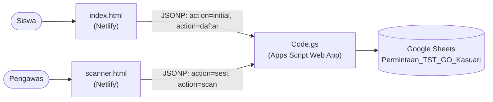
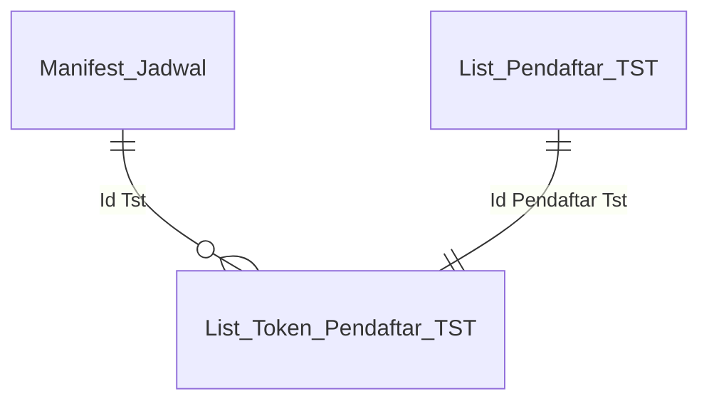
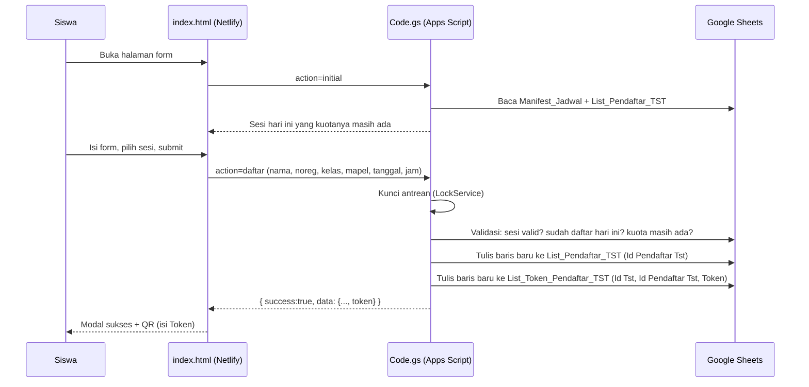
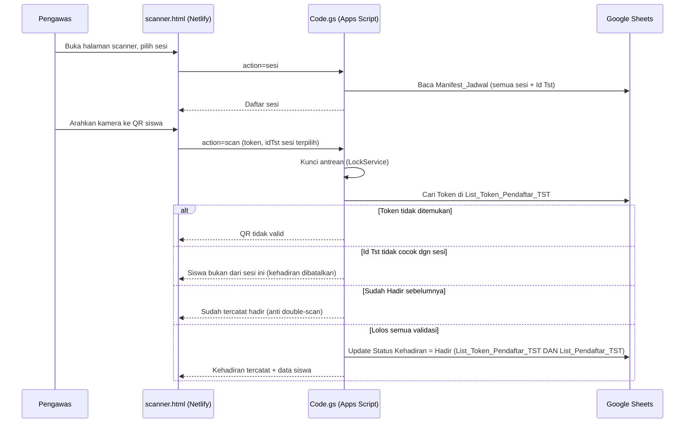

# War Tiket TST GO Kasuari

Sistem pendaftaran untuk **TST WAR UTBK** GO Kasuari — siswa mendaftar lewat form web, mendapat tiket berupa QR code, dan kehadirannya dicatat lewat scan QR oleh pengawas.
Link Form Siswa : https://war-tiket-tst-go-kasuari.netlify.app/
Link Scanner Pengajar : https://war-tiket-tst-go-kasuari.netlify.app/scanner/

## Daftar Isi

1. [Gambaran Umum](#1-gambaran-umum)
2. [Arsitektur Sistem](#2-arsitektur-sistem)
3. [Skema Spreadsheet](#3-skema-spreadsheet)
4. [Alur Sistem](#4-alur-sistem)
5. [API Backend (Apps Script)](#5-api-backend-apps-script)
6. [Struktur Proyek](#6-struktur-proyek)
7. [Cara Setup dari Awal](#7-cara-setup-dari-awal)
8. [Cara Pakai](#8-cara-pakai)
9. [Keamanan & Proteksi Akses](#9-keamanan--proteksi-akses)
10. [Troubleshooting](#10-troubleshooting)

---

## 1. Gambaran Umum

Sistem ini terdiri dari 3 bagian yang saling terhubung:

| Bagian | Peran | Tempat hosting |
|---|---|---|
| **Google Sheets** | Penyimpanan semua data (jadwal, pendaftar, token, kehadiran) | Google Drive |
| **Google Apps Script** (`Code.gs`) | Backend API — satu-satunya yang boleh baca/tulis spreadsheet | Apps Script (dijalankan atas nama pemilik spreadsheet) |
| **Frontend** (`index.html` + `scanner.html`) | Form pendaftaran siswa & scanner kehadiran pengawas | Netlify (auto-deploy dari repo GitHub) |

Aturan bisnis utama:
- 1 siswa (Nomor Registrasi) hanya boleh ikut **1 TST per hari**.
- Peserta **tidak boleh melebihi kuota** per sesi (Mapel + Tanggal + Jam), termasuk saat banyak orang submit bersamaan ("war tiket").
- Form pendaftaran **hanya menampilkan sesi hari itu** yang kuotanya masih tersedia.
- QR tiket **tidak berisi data terbaca** (bukan nama/kelas/dst) — hanya token acak, supaya tidak bisa dipalsukan/dibaca sembarangan.
- Saat scan, kehadiran hanya tercatat kalau siswa itu memang terdaftar di **sesi yang sedang dipilih pengawas**. Kalau beda sesi, atau sudah pernah scan, ditolak.

---

## 2. Arsitektur Sistem



**Kenapa JSONP, bukan `fetch()` biasa?**
Apps Script Web App tidak mengirim header CORS yang dibutuhkan `fetch()`/`XMLHttpRequest` untuk membaca respons lintas domain (dari Netlify ke `script.google.com`). JSONP mengambil data lewat tag `<script>`, yang tidak tunduk pada aturan CORS sama sekali — ini pola yang direkomendasikan Google sendiri untuk kasus ini.

**Kenapa scanner tidak di-host di Apps Script juga?**
Apps Script Web App menyajikan halamannya di dalam iframe tersandbox (opaque origin), dan browser memblokir akses kamera (`getUserMedia`) dari origin seperti itu. Dengan meng-host scanner di Netlify (origin asli), kamera live-scan bisa berfungsi normal.

---

## 3. Skema Spreadsheet

Spreadsheet: **`Permintaan_TST_GO_Kasuari`**, berisi 4 sheet:

### 3.1 `Manifest_Jadwal`
Diisi manual oleh admin — daftar sesi TST yang dibuka.

| Kolom | Field | Tipe | Keterangan |
|---|---|---|---|
| A | No | Angka | Nomor urut |
| B | Mapel | Teks | Matematika / Fisika / Kimia / Biologi / TPS |
| C | Tanggal | Date (DD/MM/YYYY) | Tanggal sesi |
| D | Jam | Teks | Contoh: `09:00 - 10:00` |
| E | Kuota | Angka | Maksimal peserta sesi ini |
| F | Pengajar | Teks | Nama pengajar/pengawas sesi |
| G | **Id Tst** | Teks | **Auto-generate** oleh trigger `onEdit` — format `Mapel-Tanggal-Jam-HASHACAK` |

> Kolom G terisi otomatis begitu kolom B–F pada baris itu diisi lengkap (lewat trigger `onEdit` di `Code.gs`). Kalau karena suatu sebab masih kosong, sistem akan mengisinya sendiri saat ada siswa pertama yang daftar ke sesi tersebut (jaring pengaman di `submitPendaftaran`).

### 3.2 `List_Pendaftar_TST`
Diisi otomatis oleh sistem saat siswa mendaftar. **Boleh dilihat editor mana pun** — tidak memuat data rahasia (Token).

| Kolom | Field | Tipe | Keterangan |
|---|---|---|---|
| A | No | Angka | Nomor urut |
| B | Mapel | Teks | |
| C | Tanggal | Date (DD/MM/YYYY) | Disalin dari Manifest_Jadwal |
| D | Jam | Teks | |
| E | Nomor Registrasi | Teks | Diisi siswa saat daftar |
| F | Nama Lengkap | Teks | |
| G | Asal Kelas | Teks | Dipilih dari `List_Asal_Kelas` |
| H | **Id Pendaftar Tst** | Teks (UUID) | Kunci penghubung ke `List_Token_Pendaftar_TST` |
| I | **Status Kehadiran** | Teks | `Tidak Hadir` (default) → `Hadir` (setelah scan) |

### 3.3 `List_Asal_Kelas`
Diisi manual oleh admin — daftar kelas yang valid, dipakai untuk dropdown "Asal Kelas" di form.

| Kolom | Field | Tipe |
|---|---|---|
| A | No | Angka |
| B | Asal Kelas | Teks |

### 3.4 `List_Token_Pendaftar_TST`
Diisi otomatis oleh sistem. **Ini sheet paling sensitif** — berisi Token asli (isi QR). Sebaiknya dibatasi aksesnya (lihat [§9](#9-keamanan--proteksi-akses)).

| Kolom | Field | Tipe | Keterangan |
|---|---|---|---|
| A | No | Angka | Nomor urut |
| B | Id Tst | Teks | Menunjuk sesi di `Manifest_Jadwal` kolom G |
| C | Id Pendaftar Tst | Teks (UUID) | Menunjuk baris di `List_Pendaftar_TST` kolom H |
| D | **Token** | Teks (UUID) | Kode rahasia — inilah yang dijadikan QR |
| E | Status Kehadiran | Teks | `Tidak Hadir` → `Hadir` (sumber utama status) |

### Relasi Antar Sheet



Kenapa Token dipisah dari `List_Pendaftar_TST`? Supaya siapa pun yang punya akses lihat/edit `List_Pendaftar_TST` (misal untuk keperluan administrasi) **tidak otomatis bisa melihat Token** — karena Token itu sendiri yang jadi "kunci" sah untuk absen. `Id Pendaftar Tst` di `List_Pendaftar_TST` aman dilihat siapa pun karena hanya berfungsi sebagai penghubung, bukan sebagai bukti kehadiran.

---

## 4. Alur Sistem

### 4.1 Alur Pendaftaran



Kalau salah satu validasi gagal (sesi tidak valid, sudah daftar hari itu, atau kuota penuh), respons `{ success:false, reason:... }` dikembalikan dan form menampilkan modal gagal dengan alasannya.

### 4.2 Alur Scan Kehadiran



---

## 5. API Backend (Apps Script)

Semua endpoint diakses lewat satu URL Web App (`.../exec`), dibedakan lewat parameter `action`. Balikan selalu JSON, dibungkus JSONP kalau ada parameter `callback`.

| Endpoint | Parameter | Balikan (ringkas) |
|---|---|---|
| `?action=initial` | — | `{ tstOptions: [...], kelasOptions: [...] }` |
| `?action=daftar` | `nama, noreg, kelas, mapel, tanggal, jam` | `{ success, data:{noreg,nama,kelas,mapel,tanggal,jam,token} }` atau `{ success:false, reason }` |
| `?action=sesi` | — | `[{ label, mapel, tanggal, jam, idTst, pengajar }, ...]` |
| `?action=scan` | `token, idTst` | `{ success, data:{...} }` atau `{ success:false, reason, data? }` |

Daftar `reason` yang mungkin muncul saat gagal: `data_tidak_lengkap`, `jadwal_tidak_valid`, `sudah_daftar_hari_ini`, `kuota_penuh`, `server_sibuk` (form); `token_kosong`, `sesi_belum_dipilih`, `token_tidak_valid`, `sesi_tidak_cocok`, `sudah_absen`, `data_tidak_konsisten`, `error_sistem` (scanner).

---

## 6. Struktur Proyek

**Apps Script (1 file):**
```
Code.gs      — seluruh logika backend + trigger onEdit
```

**Repo GitHub → Netlify (auto-deploy):**
```
index.html     — form pendaftaran siswa
scanner.html   — scanner kehadiran pengawas
README.md      — dokumentasi ini
```

---

## 7. Cara Setup dari Awal

1. **Spreadsheet**: buat 4 sheet sesuai skema di [§3](#3-skema-spreadsheet), termasuk header baris 1 persis seperti nama kolom di atas.
2. **Apps Script**: Extensions > Apps Script dari spreadsheet, tempel isi `Code.gs`, sesuaikan `SPREADSHEET_ID` di baris paling atas kalau perlu.
3. **Deploy**: Deploy > New deployment > Web app > Execute as: **Me** > Who has access: **Anyone**. Salin URL `.../exec`-nya.
4. **Repo GitHub**: buat repo baru, upload `index.html`, `scanner.html`, `README.md`.
5. Di **kedua** file HTML, ganti nilai `APPS_SCRIPT_URL` dengan URL dari langkah 3.
6. **Netlify**: Add new site > Import an existing project > pilih repo GitHub tadi > Deploy.
7. Uji: buka URL Netlify → coba daftar → cek data masuk ke sheet → scan QR-nya di `scanner.html` → cek status berubah Hadir.

Untuk update kode berikutnya: edit file di GitHub (atau push lewat git), Netlify otomatis re-deploy. Untuk update `Code.gs`: edit di Apps Script editor, lalu **Deploy > Manage deployments > pensil > New version > Deploy** (wajib, kalau tidak perubahan tidak aktif).

---

## 8. Cara Pakai

### Untuk Siswa
1. Buka link form (dibagikan panitia).
2. Isi Nama Lengkap, Nomor Registrasi, pilih Asal Kelas dan Pilihan TST.
3. Klik "Amankan Tiket".
4. Kalau berhasil, muncul QR — **screenshot QR ini**, tunjukkan ke pengawas saat sesi TST berlangsung.

### Untuk Pengawas
1. Buka link scanner (dibagikan panitia, **jangan disebar ke siswa**).
2. Pilih sesi yang sedang berlangsung dari dropdown.
3. Klik "Mulai Scan", izinkan akses kamera.
4. Arahkan kamera ke QR siswa satu per satu — hasil (berhasil/gagal beserta alasan) muncul otomatis di layar.

### Untuk Admin
- Isi jadwal di `Manifest_Jadwal` (Mapel, Tanggal, Jam, Kuota, Pengajar) — kolom Id Tst terisi sendiri.
- Isi daftar kelas yang valid di `List_Asal_Kelas`.
- Pantau pendaftar & kehadiran langsung dari `List_Pendaftar_TST`.

---

## 9. Keamanan & Proteksi Akses

Rekomendasi pembagian akses kalau spreadsheet dipakai bersama beberapa akun:

- **Semua akun panitia**: Editor di level spreadsheet.
- **`List_Pendaftar_TST`**: proteksi lewat Data > Protect sheets and ranges, custom permission — hanya akun yang benar-benar perlu mengedit yang diizinkan.
- **`List_Token_Pendaftar_TST`**: paling sensitif — idealnya dibatasi ke akun pemilik saja. Ingat: proteksi Sheets **hanya mengunci edit, bukan melihat** — siapa pun dengan akses Editor ke file tetap bisa melihat & copy isi sheet yang tidak diproteksi/di-hide. Hide column juga **bukan proteksi sungguhan** (editor lain bisa unhide 1 klik) — pemisahan ke sheet dengan akses berbeda adalah cara yang benar-benar efektif.
- `Manifest_Jadwal` dan `List_Asal_Kelas` boleh diedit bebas oleh semua panitia karena tidak memuat data sensitif.

---

## 10. Troubleshooting

| Gejala | Kemungkinan penyebab |
|---|---|
| Form/scanner "Gagal memuat data" | `APPS_SCRIPT_URL` di HTML masih placeholder, atau belum deploy versi baru Apps Script |
| Error kamera "Permission denied" di scanner | Dibuka lewat in-app browser (WhatsApp/IG) — buka lewat Chrome/Safari langsung |
| Error "Anda tidak dapat menetapkan format nomor sel..." | Jangan pernah panggil `setNumberFormat()` pada rentang yang mencakup banyak baris/kolom sekaligus dari script — versi kode saat ini sudah tidak memakainya sama sekali |
| Siswa lama tidak bisa di-scan setelah update skema Token | QR lama dibuat sebelum `List_Token_Pendaftar_TST` ada — siswa perlu daftar ulang, atau token lama perlu dimigrasikan manual |
| Sesi baru tidak muncul di form padahal kuota & tanggal benar | Cek tanggal di Manifest_Jadwal memang = tanggal HARI INI (form hanya tampilkan sesi hari itu) |
| Deploy sudah diedit tapi perubahan tidak terasa | Lupa "New version" saat Deploy > Manage deployments — edit saja tidak otomatis aktif di URL yang sama |

---

*Dokumentasi ini dibuat untuk proyek War Tiket TST GO Kasuari — perbarui bagian yang relevan setiap kali ada perubahan skema atau alur.*
